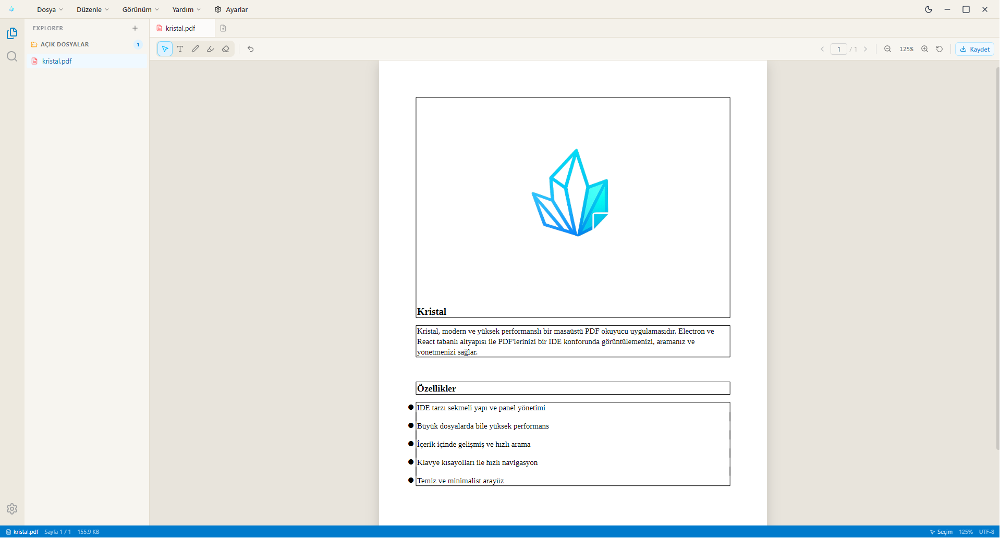

# 💎 Kristal

> **"Kristal: Modern ve yüksek performanslı bir masaüstü PDF okuyucu uygulaması."**

Kristal, PDF belgelerinizi standart bir okuyucunun ötesine taşıyarak, bir **IDE konforunda** görüntülemenizi, aramanızı ve yönetmenizi sağlayan Electron ve React tabanlı modern bir masaüstü uygulamasıdır. Hız, hafiflik ve geliştirici dostu arayüz elementleri ön planda tutularak tasarlanmıştır.

---

## 📸 Ekran Görüntüleri



---

## ✨ Özellikler

*   ⚡ **Yüksek Performans:** Büyük boyutlu ve kompleks PDF dosyalarında bile akıcı kaydırma ve hızlı yükleme.
*   🔍 **Gelişmiş Arama (IDE Tarzı):** Doküman içinde regex destekli, hızlı ve indekslenmiş arama paneli.
*   🎨 **Modern & Özelleştirilebilir Arayüz:** Gözü yormayan koyu mod (Dark Mode) desteği ve minimalist IDE esintili yerleşim.
*   📂 **Gelişmiş Sekme ve Yan Panel Yönetimi:** Birden fazla PDF'i sekmeler halinde açabilme, içindekiler tablosunu ve yer işaretlerini kolayca yönetme.
*   🛠️ **Geliştirici Araçları & Kısayollar:** Klavye kısayolları ile tamamen mouse-free kontrol imkanı.

---
## 🚀 Teknolojik Altyapı

Kristal, gücünü modern web teknolojileri ve masaüstü adaptasyon araçlarından alır:

*   **Electron:** Güçlü masaüstü entegrasyonu ve cross-platform desteği.
*   **React:** Bileşen tabanlı, hızlı ve dinamik arayüz yönetimi.
*   **PDF.js :** PDF renderlama süreçlerinde yüksek doğruluk ve performans.
*   **TypeScript:** Güvenli ve sürdürülebilir bir kod tabanı.

---

## 🛠️ Kurulum ve Çalıştırma

Projeyi yerel bilgisayarınızda çalıştırmak için aşağıdaki adımları takip edebilirsiniz.

### Gereksinimler

*   [Node.js](https://nodejs.org/) (v18 veya üzeri önerilir)
*   npm veya yarn

### Adımlar

1.  **Projeyi Klonlayın:**
    ```bash
    git clone https://github.com/burakwa/kristal
    cd kristal
    ```

2.  **Bağımlılıkları Yükleyin:**
    ```bash
    npm install
    # veya
    yarn install
    ```

3.  **Geliştirme Modunda Çalıştırın:**
    ```bash
    npm run dev
    # veya
    yarn dev
    ```

---

## 📦 Derleme (Build)

Uygulamayı canlıya almak veya kurulabilir bir paket haline getirmek için işletim sisteminize uygun komutu çalıştırabilirsiniz:

```bash
# Windows, macOS veya Linux için üretim paketini hazırlar
npm run build
# veya
yarn build
```
---

## ⚠️ Yasal Uyarı (Disclaimer)

**TR:** Bu yazılım "olduğu gibi" (as is) sunulmaktadır. Geliştirici, uygulamanın kullanımı sırasında veya kullanımı nedeniyle meydana gelebilecek veri kayıpları, sistem hataları, donanım hasarları veya herhangi bir doğrudan/dolaylı zarardan hiçbir şekilde sorumlu tutulamaz. Uygulamayı kullanmak ve PDF dosyalarınızı bu uygulama ile açmak tamamen kullanıcının kendi sorumluluğundadır.

**EN:** This software is provided "as is", without warranty of any kind, express or implied. In no event shall the authors or copyright holders be liable for any claim, damages, or other liability, whether in an action of contract, tort, or otherwise, arising from, out of, or in connection with the software or the use or other dealings in the software.